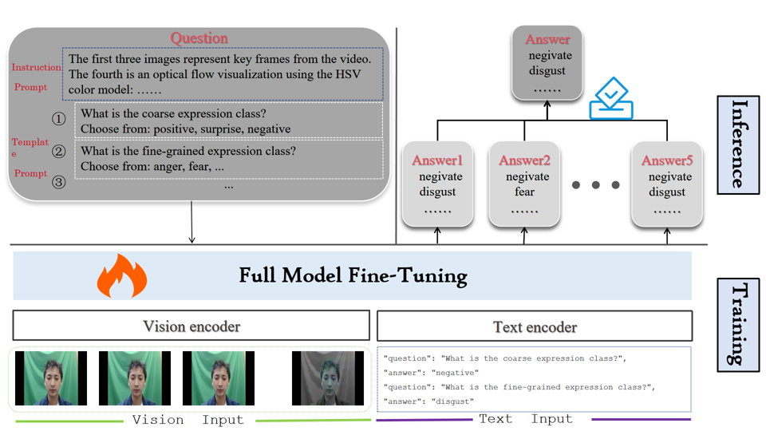

# MEGC2025 Competition Code 🏆

Official implementation of our solution for the **MEGC2025 Micro-Expression VQA** competition, where we achieved **3rd place**.

---

## 📌 Abstract

**Micro-Expression Visual Question Answering (ME-VQA)** is a challenging multimodal task that requires both **fine-grained temporal visual modeling** and **language-based reasoning** to interpret subtle facial muscle movements and their emotional semantics. However, micro-expression videos are typically **short**, contain **weak motion signals**, and suffer from **limited annotations**, which makes robust learning difficult.

To address these challenges, we propose a **Temporal Information-Enhanced Vision–Language Framework** tailored for ME-VQA.

Our method is built on **Qwen2.5-VL-7B-Instruct** and takes two complementary inputs:

- **Raw video sequence** for capturing *global temporal context*
- **Static optical flow map** (computed between **onset** and **apex** frames) for highlighting *localized motion cues*

We adopt **full-parameter supervised fine-tuning** to adapt the model for micro-expression understanding, improving both **fine-grained motion perception** and **high-level semantic reasoning**. During inference, we further improve response quality by using **structured prompt templates** to encourage coherent and accurate outputs.

Experiments on **SAMM** and **CAS(ME)³** show consistent improvements over baseline methods across multiple metrics, with an average gain of **+0.19**, demonstrating strong effectiveness and generalization for ME-VQA. Our final system secured **3rd place** in the **MEGC2025** competition.

---

## 🧩 System Overview

[](./image.png)

---

## ⚙️ Setup & Usage

### 1) Data Preparation

1. Download and place **SAMM** or **CAS(ME)II** training data into:
```bash
dataset/
```
2. Run preprocessing scripts in:
```bash
data_process/
```
3. Prepare a local multimodal LLM environment (e.g., **Qwen2.5-VL-7B-Instruct**).

---

### 2) Training

1. Build the training dataset:
```bash
python train/set_train_dataset.py
```

2. Train the model:
```bash
python train.py
```
### 3) Testing

Run the scripts in:
```bash
test/
python train.py
```
to generate predictions and evaluation outputs.

### 4) Ablation Study

Prepare datasets:
```bash
python ablation/set_train_dataset.py
python ablation/set_test_dataset.py
```
Note: You need to manually split the dataset into train/test sets beforehand.

Train & infer:
```bash
python train/train.py
bash infer.sh
```
Metrics are provided in:
```bash
ablation/Metrics/
```

## 📊 Results & Resources

All final predictions and ablation outputs are saved in:
```bash
result/
```
Trained model weights:
 [Baidu Netdisk](https://pan.baidu.com/s/1lTlTtkGHZLNnB2FG2a2xEQ?pwd=5z91)

Aligned training dataset:
```bash
dataset/train_dataset.jsonl
```
You can directly use the released pretrained model for evaluation.

## 📎 Notes

If you find this repository useful, feel free to ⭐ star it or cite our solution in your work.

